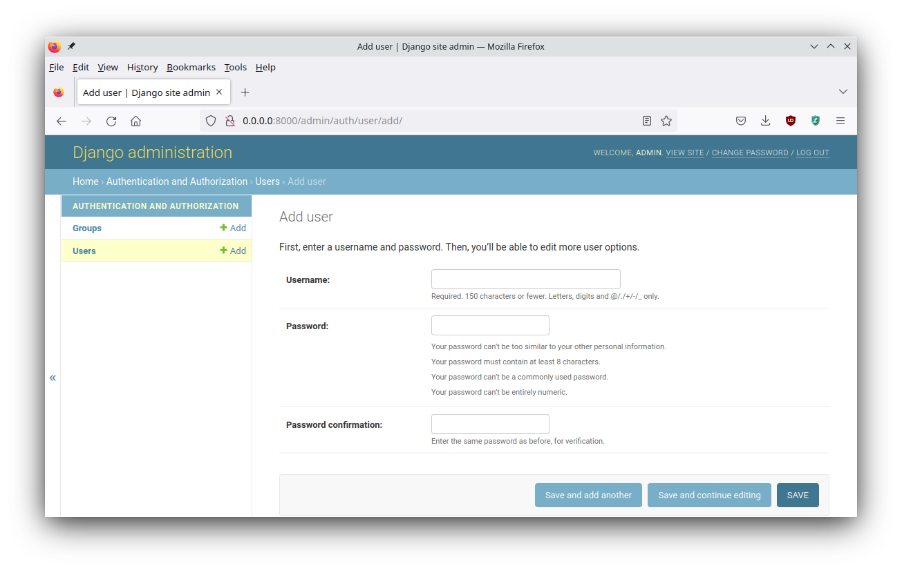

# Notifier

Notifier is a very simple website that catches alert notifications.

The notifications are created by performing a post request.
This can be done with one line of Powershell, so it is easy and fast to 
include in scripts.

The idea is not to use this as a monitoring tool for a large number of machines, 
but rather, to quickly write one-off scripts to monitor a specific event at on a 
specific system.

Maybe a certain error only rarely occurs, and you want to get 
notified when it happens. Instead of checking the log file on a daily basis,
_notifier_ was created, so you can quickly whip up a monitoring script to do 
the checking for you.

## Filters

The system has pagination and bookmarkable filters.

The URL http://0.0.0.0:8000/?description=100&customer=Contoso&system=System 
will only show events that contain **100** in their description, **Contoso**  
in their customer field and **System** in their system field.

# Installing Notifier

This is an explanation for Linux.
Both development and deployment could be done on Windows in theory, I haven't
tested this.

## Retrieve the source code

Download the source code. Either clone the git respository or download
the zip file.

```sh
curl https://codeload.github.com/sir-ragna/notifier/zip/refs/heads/main -o notifier-main.zip   
unzip notifier-main.zip
cd notifier-main
```

## Install the Python dependencies

Set up a Python virtual environment. This will prevent issues between Python 
system modules and the versions used by this program. This allows us to run 
old and outdated programs.

```sh
python -m venv venv
```

The above command creates a virtual in the directory `venv`.
Activate the environment and install the dependencies from the _requirements.txt_ file.

```sh
source venv/bin/activate
pip install -r requirements.txt
```

### Set up Django for use

We need to initiate the database. You also need to do this when upgrading.

    python manage.py migrate

In order to sign in in the web interface. We need to create an initial user.

    python manage.py createsuperuser --username admin

## Setting up the service

It is best practice to create a separate user for this service.

```
useradd -c "notifier service user" -r -d /opt/notifier/ -s "/sbin/nologin" notifier
```

Fix the permissions on the working directory.

```
chown notifier:notifier -R /opt/notifier
```

Set up a systemd service file.
The systemd service file should include
- the required environment variables. TIME_ZONE and SECRET_KEY are required.
- the gunicorn command to run the WSGI service
- the user and group you want to use to run the service under

Here is an example of a systemd service file.

```
[Unit]
Description=notifier daemon
#Requires=
After=network.target

[Service]
Type=notify
# the specific user that our service will run as
User=notifier
Group=notifier
# another option for an even more restricted service is
# DynamicUser=yes
# see http://0pointer.net/blog/dynamic-users-with-systemd.html
#RuntimeDirectory=/opt/notifier
WorkingDirectory=/opt/notifier
Environment=TIME_ZONE=CET
Environment=SECRET_KEY=generate-a-random-secret-key
ExecStart=/opt/notifier/venv/bin/gunicorn notifier.wsgi --bind 0.0.0.0:8000 --log-file -
ExecReload=/bin/kill -s HUP $MAINPID
KillMode=mixed
TimeoutStopSec=5
PrivateTmp=true

[Install]
WantedBy=multi-user.target
```

## Serving static files

Gunicorn isn't made to serve static files.
For this reason it is best to run an Nginx in front of the app to serve the 
static files. We need Nginx to redirect the non-static requests to the app but
all the static files, such as images, javascript and css files should be served
by Nginx.

At a basic Nginx configuration level you will split up the static and dynamic part.

```
    location / {
        proxy_pass http://10.0.0.1:8000/;
    }
    location /static/ {
        root   /usr/share/nginx/notifier;
    }
```

### static files

First we need to collect the static files.

```
source venv/bin/activate       # don't forget this before you try to run anything
python manage.py collectstatic # writes static files to ./nginx/static
```

Put these files on your Nginx server in `/usr/share/nginx/notifier`.


# User Management

It is possible to create users from the cmdline. This is required to 
at least create one initial user.

    python manage.py createsuperuser --username admin

More users can be created from the `/admin/` page that is built-into Django.



## Keeping up-to-date

Because of the simplicity of the current set-up. 
The following script can be used to install updates.

```sh
#!/bin/bash

## Update the notifier app to the latest git commit
pushd notifier # enter notifier dir
git pull       # pull in the latest changes
source venv/bin/activate        # activate virtual environment
pip install -r requirements.txt # install the requirements
python manage.py migrate        # perform database updates
popd                            # return to previous dir
chown -R notifier:notifier notifier # set the permissions right
systemctl restart notifier          # restart the service
```

## Containers

Optionally, Notifier can be run inside an OCI container with either docker or podman.

Build the container using buildah.

    buildah build --layers --tag="notifier:v0.6" .  

Run the container using podman.

    podman run --rm -it -p 8000:8000 -v $(pwd)/database:/app/database notifier:v0.6

    podman run --rm -it -p 8000:8000 -v $(pwd)/database:/app/database -v $(pwd)/attachments:/app/attachments -e SECRET_KEY='django-insecure-a62c754d-d754-4c40-a81a-73e6bff62ac6' localhost/notifier:v0.6

The container is using [gunicorn](https://gunicorn.org/) 
to run Django. As such it will not serve any
static files. To serve static files you are supposed to run an nginx server in 
front. To test this I have a Dockerfile and nginx configuration file in 
the nginx directory.

# Development setup

Requires python 3. Instantiate the virtual environment, activate it and install
the dependencies.

```sh
python -m venv venv
source venv/bin/activate
pip install -r requirements
```

Initiate the database and create a new superuser.

```sh
python manage.py migrate
python manage.py createsuperuser
```

The **run.sh** script will apply migrations and start the site in debug mode.
Django will restart itself when you save changes.

```sh
./run.sh
```
